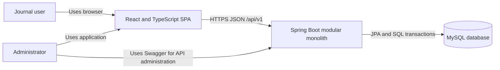
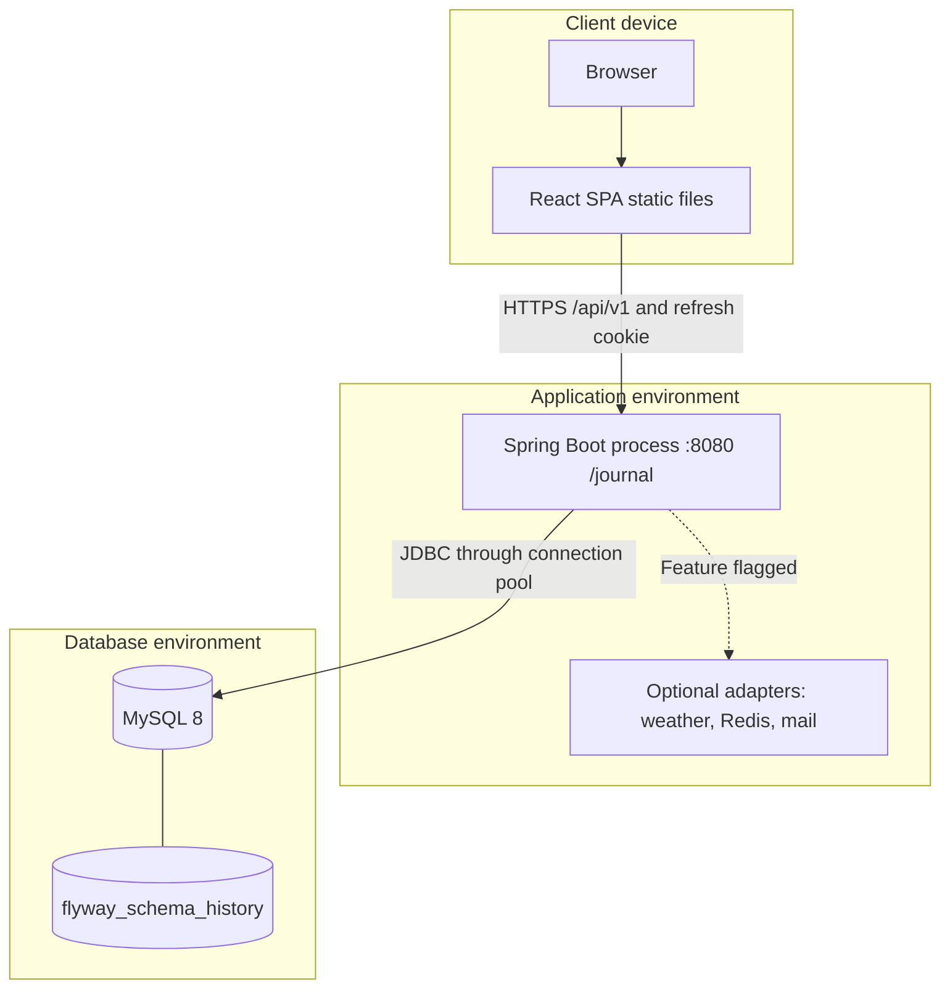
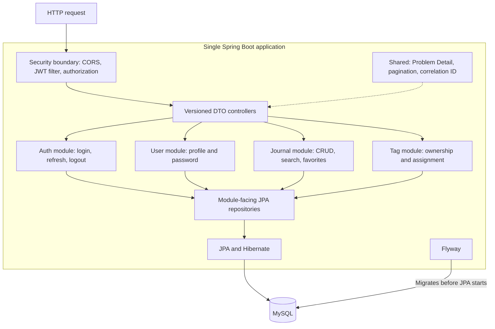
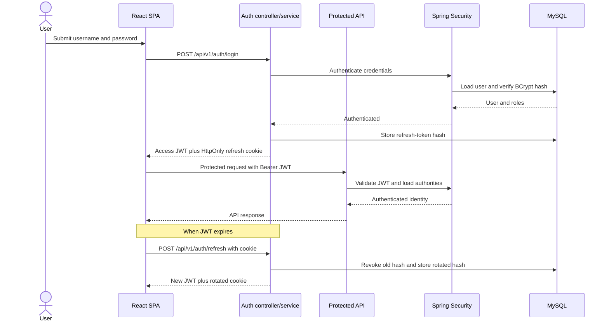
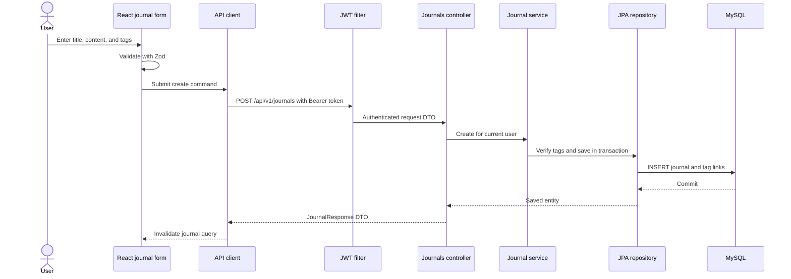
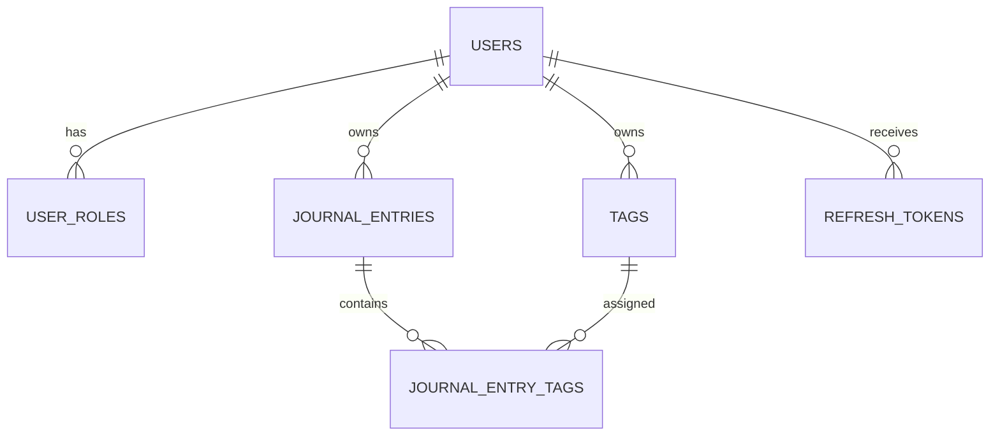
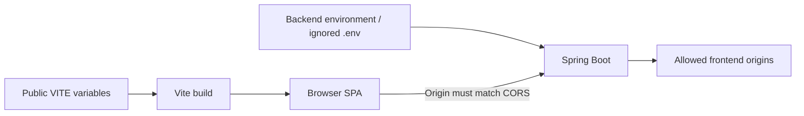

# Phase 1 Architecture

## 1. System context

Phase 1 is a modular monolith: one Spring Boot deployment and one MySQL
database, with business responsibilities separated inside the codebase. The
React SPA is a separate application that depends only on the HTTP contract.



This keeps deployment and database transactions simple while creating boundaries
that can be evaluated for extraction during Phase 2.

The frontend knows only the versioned HTTP contract. It does not connect to the
database or import backend Java classes.

## 2. Container and deployment view



The SPA and backend are separate deployables even though they share one Git
repository. MySQL is the only required Phase 1 runtime dependency.

## 3. Backend component view



All modules execute inside the same process. Calls between them are normal Java
method calls, and a service transaction can update related tables atomically.

## 4. Repository structure

```text
journalApplication/
|-- src/main/java/.../
|   |-- auth/          access and refresh-token lifecycle
|   |-- user/          profile DTOs and mapping
|   |-- journal/       journal DTOs, mapping, and search criteria
|   |-- tag/           user-owned tag domain
|   |-- controller/    versioned HTTP boundary
|   |-- service/       application rules and transactions
|   |-- repository/    JPA persistence interfaces
|   |-- entity/        user and journal persistence models
|   |-- config/        security, OpenAPI, Redis, and time configuration
|   |-- filter/        JWT authentication
|   `-- shared/        errors, pagination, and correlation IDs
|-- src/main/resources/
|   `-- db/migration/ versioned Flyway SQL
|-- frontend/
|   |-- src/app/       router, providers, and Query client
|   |-- src/features/  auth, profile, journals, and tags
|   |-- src/pages/     route-level screens
|   |-- src/components reusable UI
|   |-- src/lib/       shared API client
|   `-- src/test/      frontend test setup
|-- docs/
|-- pom.xml
`-- README.md
```

Controllers accept validated request DTOs and return response DTOs. JPA entities
remain inside the backend and are never serialized as the public contract.

## 5. Authentication flow



The frontend keeps the access token in memory and sends it in the
`Authorization` header. When it expires, one shared refresh request rotates the
HttpOnly cookie and the original request is retried once. Logout revokes the
refresh token.

## 6. Journal request flow

Example: create a journal.



Every journal and tag query is scoped by the authenticated username or user ID,
so another user's resource behaves as not found.

## 7. Database structure



Main tables:

- `users` and `user_roles`: identity, password hash, and roles.
- `journal_entries`: owned content, audit timestamps, and favorite flag.
- `tags`: normalized user-owned reusable names.
- `journal_entry_tags`: many-to-many association.
- `refresh_tokens`: token hashes, expiry, revocation, and creation time.
- `flyway_schema_history`: applied migration versions and checksums.

Flyway owns schema changes. Hibernate uses `ddl-auto=validate` to detect a
mismatch between Java mappings and the migrated schema.

## 8. Frontend state

- TanStack Query manages remote server state and cache invalidation.
- React context manages the in-memory authenticated session.
- React Hook Form and Zod manage form state and validation.
- URL query parameters preserve dashboard search, filters, sorting, and page.
- Local component state handles temporary UI behavior.

A general Redux store is unnecessary because no cross-application client state
currently justifies it.

## 9. Runtime configuration



Backend secrets come from environment variables or the ignored local `.env`.
Frontend `VITE_*` variables are public build-time settings. Local development
allows `http://localhost:5173` through CORS; production must list the actual
HTTPS frontend origin.

Weather, Redis, mail, and sentiment scheduling are optional integrations and do
not participate in core journal CRUD startup or health.
