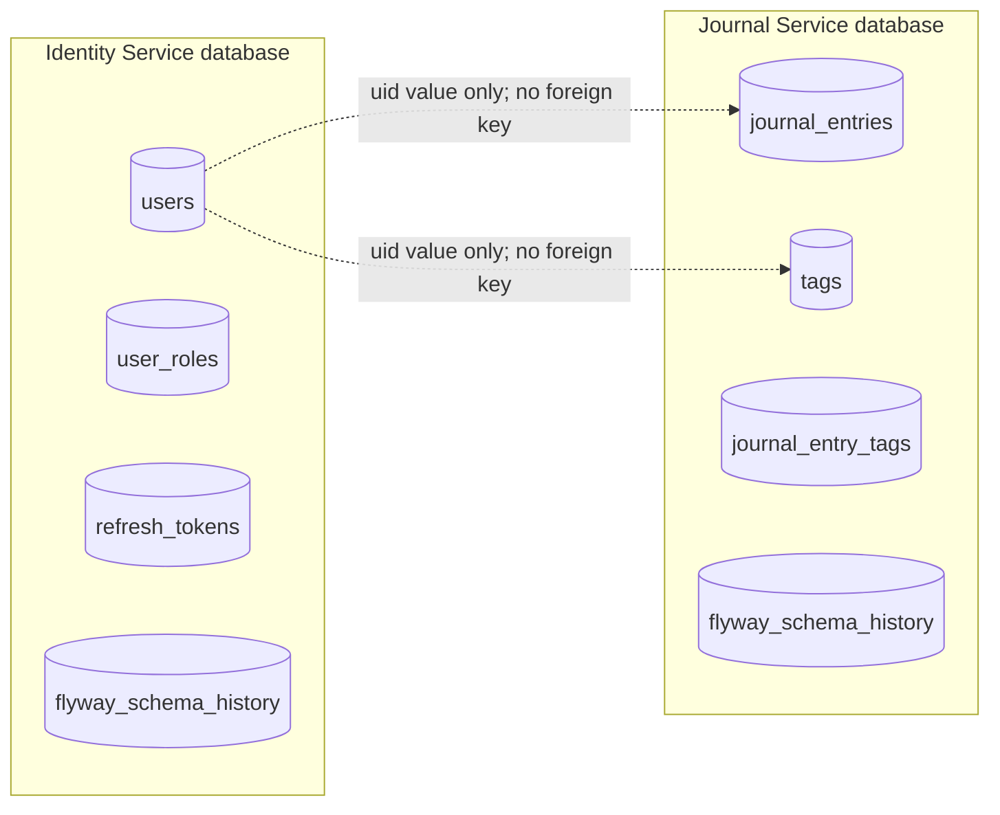

# Phase 2 Data Ownership and Migration

## Target ownership



Each service has its own datasource credentials and Flyway history table. In
production these should be separate databases or schemas with permissions that
prevent cross-service reads.

## Identity schema

Identity owns:

- `users`
- `user_roles`
- `refresh_tokens`

Only Identity can change passwords, profiles, roles, or refresh-token state.

## Journal schema

Journal owns:

- `journal_entries`
- `tags`
- `journal_entry_tags`

`journal_entries.owner_id` and `tags.owner_id` store the immutable Identity
user ID. They are indexed but are not foreign keys to the Identity database.

Why no cross-database foreign key: a database-level relationship would let one
service depend directly on another service's storage and prevent independent
migration or availability.

## Migration sequence

1. Back up the Phase 1 MySQL database.
2. Add the immutable `uid` claim while the monolith still owns all data.
3. Create an empty Journal database through Journal-owned Flyway migrations.
4. Rehearse a migration job that copies journals, tags, and links while
   preserving IDs and converting `user_id` to `owner_id`.
5. Verify row counts, owner counts, orphan counts, and representative API results.
6. At cutover, pause journal writes, clear the rehearsal data, and run one final
   full snapshot copy. This avoids needing change-data capture for updates/deletes.
7. Re-run verification and switch only journal/tag frontend traffic.
8. Keep the old journal tables read-only for a defined rollback window.
9. Remove old tables only in a later verified migration.

The one-time cross-database copy is not an application Flyway migration because
each Flyway instance must own only its service schema. The copy runs as an
explicit, reviewed migration job with a report.

If rollback is required after new writes reached Journal Service, pause writes
again and run a reviewed reverse reconciliation before routing traffic to the old
tables. A URL switch alone is safe only when no post-cutover writes occurred.

## Consistency rules

- Journal creation needs no Identity database transaction; a valid signed token
  supplies `uid`.
- Journal ownership is checked locally with `owner_id`.
- A deleted or disabled user may still have data until a defined purge workflow
  completes.
- User deletion is not added until retention, retry, audit, and failure behavior
  are specified.

Future deletion workflow:

```text
Identity marks account DELETION_PENDING and revokes sessions
  -> authenticated idempotent purge request to Journal
  -> Journal deletes owner data and returns success
  -> Identity deletes or anonymizes the user
  -> failed steps remain retryable
```

Kafka-based propagation is deliberately deferred to Phase 3. Phase 2 first makes
the synchronous consistency cost explicit.

## Environment separation

Local, QA, staging, and production each run their own pair of schemas and their
own Flyway histories:

| Environment | Identity database | Journal database |
|---|---|---|
| Local | Local developer schema | Local developer schema |
| QA | QA identity schema | QA journal schema |
| Staging | Staging identity schema | Staging journal schema |
| Production | Production identity database | Production journal database |

The same migration files move forward through environments. Data and credentials
never move backward from production.
