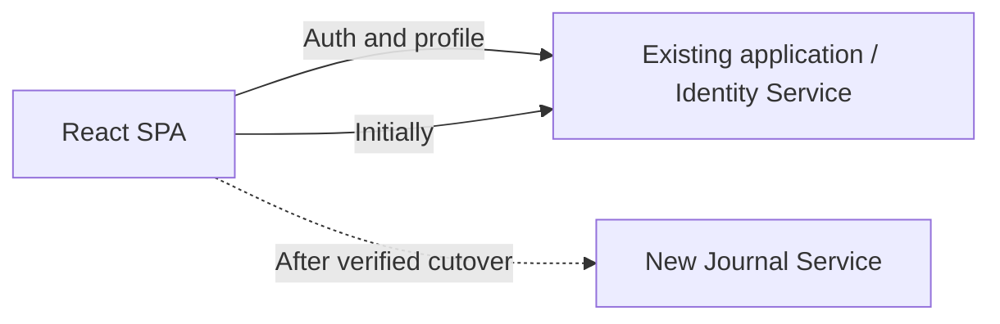

# Phase 2 Extraction Plan

## First extraction decision

Extract Journal Service first and leave Identity Service in the existing Spring
Boot application.

Why:

- Journal and tags already form a cohesive capability.
- Their public API and ownership tests are stable.
- They can authorize from JWT claims without synchronous Identity calls.
- Authentication remains available while journal extraction is tested.
- Extracting Identity first would make every remaining protected endpoint depend
  immediately on distributed token validation.

## Strangler approach

The existing journal endpoints remain available until the new service reaches
functional parity. Traffic switches by frontend environment configuration, not
by deleting working code first.

## Planned Phase 2 increments

### 2.1 Service boundaries

- Enforce package ownership and remove cross-module repository access.
- Freeze public DTO contracts and identify shared infrastructure contracts.
- Add `uid` and roles to access tokens with compatibility tests.

### 2.2 Extract Journal Service

- Create a second Spring Boot Maven module/application.
- Move journal/tag controllers, services, entities, repositories, and tests.
- Give it its own port, configuration, health endpoint, and OpenAPI document.
- Initially validate the existing JWT for behavioral parity.

### 2.3 Database separation

- Create Journal-owned Flyway migrations and datasource.
- Copy existing journal/tag data with verification reporting.
- Remove database foreign keys to Identity and use indexed `owner_id`.
- Cut over only after read/write parity and rollback checks pass.

### 2.4 Service communication

- Keep normal journal requests free from Identity network calls.
- Define authenticated, versioned internal contracts only for justified workflows.
- Add timeouts, idempotency, correlation propagation, and failure tests.

### 2.5 Distributed authentication

- Move from shared HMAC verification to Identity-owned asymmetric signing.
- Publish/ship trusted public keys with `kid`-based rotation.
- Verify issuer, audience, expiry, token ID, user ID, and roles in each service.

### 2.6 Integration testing

- Contract tests for frozen HTTP shapes.
- Component tests with each service and its own database.
- Cross-service authentication and failure-isolation tests.
- Full frontend journey against both running services.

### 2.7 Phase verification

- Re-run Phase 1 user journeys.
- Demonstrate one service and database failing without corrupting the other.
- Record latency and operational complexity compared with the monolith.

## Rollback plan

- Do not dual-write from the browser.
- Keep the Phase 1 journal tables unchanged and read-only during the rollback window.
- Switch the frontend Journal API base URL back to the existing application if
  the new service fails acceptance and no new writes were accepted.
- If new writes were accepted, pause writes and run the reviewed reverse
  reconciliation first; record the cutover timestamp and migrated IDs.
- Never drop old tables in the same release that performs traffic cutover.

## Acceptance criteria for extraction

- Public journal/tag responses remain compatible.
- Ownership and cross-user denial behave exactly as Phase 1.
- Both services start and test independently.
- Each service can access only its own database.
- Journal access does not synchronously call Identity.
- Authentication, health, errors, CORS, and correlation IDs are verified.
- A documented rollback has been rehearsed before old code is removed.
