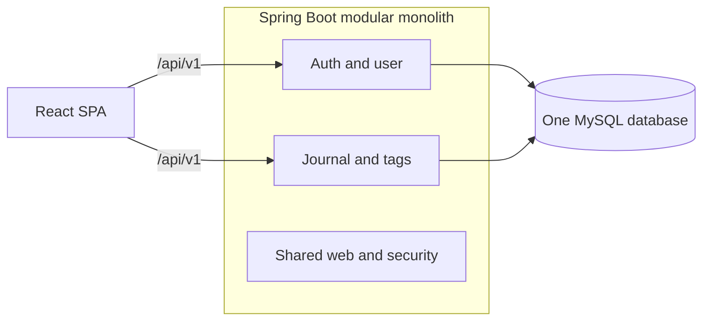
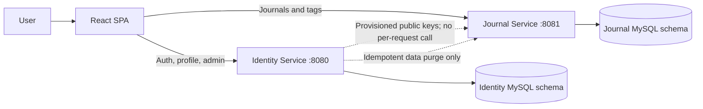
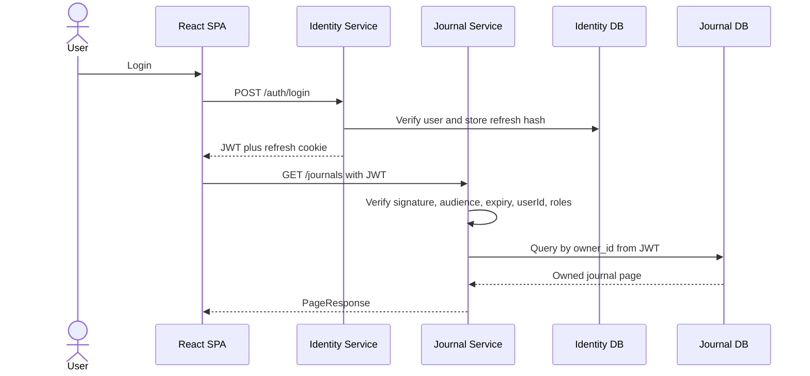

# Phase 2 Microservices High-Level Design

## Purpose

Phase 2 is a learning extraction, not a response to measured scale. The goal is
to preserve Phase 1 behavior while demonstrating independent runtime and data
ownership. Only two business services are justified.

## Current Phase 1 baseline



All modules are Java method calls inside one process. One database transaction
can update related tables.

## Target Phase 2 architecture



The SPA temporarily knows two service base URLs because an API gateway is
deliberately deferred to Phase 5. This makes the cost of service extraction
visible instead of hiding it behind new infrastructure.

Local target URLs:

- Identity: `http://localhost:8080/journal/api/v1`
- Journal: `http://localhost:8081/journal/api/v1`

Both services allow the configured frontend origin. Production uses HTTPS and
real hostnames supplied through environment configuration.

## Runtime behavior



The Journal Service does not call Identity for each request. If Identity is
temporarily unavailable, already-issued access tokens continue to work until
they expire; login and refresh do not.

## Distributed authentication target

The access token contains:

- `sub`: display/login identity
- `uid`: immutable numeric user ID used for data ownership
- `roles`: authorization authorities
- `iss`, `aud`, `iat`, `exp`, and `jti`

During the first extraction increment, both services may temporarily validate
the existing HMAC token using the same secret. This is a migration compromise:
any service holding that secret can also sign tokens.

Phase 2.5 replaces it with asymmetric signing:

```text
Identity Service: private key signs tokens
Journal Service: public key only verifies tokens
```

Key IDs and overlapping public keys support rotation. The Journal Service never
receives the private signing key.

## Alternatives and operational cost

| Option | Decision | Reason |
|---|---|---|
| Keep the modular monolith | Best product choice today | Lowest operational cost; Phase 2 is intentionally a learning exercise |
| Extract Identity first | Rejected | Changes the security foundation while the first service boundary is still being learned |
| Extract Journal first | Selected | Cohesive APIs/data and no normal synchronous dependency on Identity |
| Shared database | Rejected | Services would remain coupled through tables, migrations, and credentials |
| Tag or Admin microservices | Rejected | No independent transaction, ownership, or scaling boundary |

Compared with Phase 1, the target requires two processes, two database schemas,
two sets of migrations, two health/OpenAPI endpoints, two CORS policies, multiple
frontend base URLs, cross-service authentication, and failure-isolation tests.
That cost is accepted for architectural learning, not because current traffic
requires it.

## Failure isolation

| Failure | Expected behavior |
|---|---|
| Identity Service down | Existing JWT journal access works; login/refresh/profile fail |
| Journal Service down | Login/profile work; journal screens show retryable failure |
| Identity DB down | Identity operations fail; Journal DB remains usable |
| Journal DB down | Journal operations fail; Identity remains usable |
| Invalid or expired JWT | Each service independently returns Problem Detail `401` |
| Untrusted frontend origin | The receiving service rejects the CORS request |

Correlation IDs are accepted or generated by each service. A service-to-service
request forwards the same ID so logs can be searched across processes.

## Explicit non-goals

- No Kafka or Redis use case in Phase 2.
- No API gateway, service mesh, Kubernetes, or cloud deployment.
- No separate tag service; tags share journal ownership and transactions.
- No weather, email, or sentiment microservice without an independently useful workflow.
